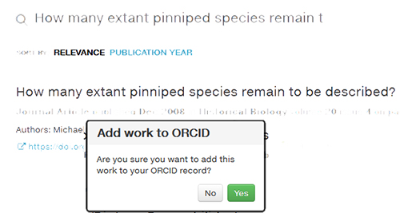

#  Adding Works to your ORCID profile

45 Minutes

---

## Learning Objectives

* Enter research contributions to the 'Works' section of your ORCID profile using three different methods
* Compare displayed citations added by these different methods
* Practice editing a record, once added from a preferred source
* Manage duplicate records

---

## Exercise 1. Add a work to your ORCID Profile using its Digital Object Identifier (DOI)

In the 'Works' section of the ORCID profile, click on the Tab '+ Add Works'. Select the option 'Add DOI'. A dialog box will display for 'ADD WORK'. In the blank text box, enter the DOI for the work you wish to add. The illustration below shows how to add a paper from Hugh Shanahan's ORCID profile, using the DOI `10.1016/j.cbpa.2009.04.470` but you are encouraged to add a DOI for your own work instead!

-----

Click on the blue button 'Retrieve work details' and a metadata form will display with details populated from the DOI record. Leave the form as is; scroll to the bottom to set the privacy to 'Trusted', and click 'Add to list'.

-----

Back in your ORCID profile, refresh the 'Works' section by clicking on the 'Sort' button and select 'Title'. Now look on the screen to make sure the work you just added displays. 
The illustration below shows the displayed version of Hugh Shanahan's work associated with `10.1016/j.cbpa.2009.04.470`.  

Note that at the bottom of this record in your ORCID 'Works' list, the 'Source:' is credited as your name. That means that that this record was imported by you and is editable by you. It is not a authoritative record from a 'trsuted' source -- a data provider with which ORCID has established a trusted relationship. 

Because this record was added by you, you may edit this record to your heart's content.  In the bottom right corner of the record, click on the pencil icon to open up the record for editing. When the metadata template opens up, you may change a field or add data to an empty field. For this record, add a few words to the 'Description' field (for example, type "This is my paper"" or "I borrowed this paper from Hugh for testing purposes"). Save and close the record.

-----

-------------------------

## Exercise 2. Add a work to your ORCID Profile using the 'Search & link' tool

In the 'Works' section of the ORCID profile, click on the Tab '+ Add Works'. Select the option 'Search & link; a long list of searchable databases will display. Scroll to the link for "CrossRef Metadata Search".

The link takes you to the database for the CrossRef DOI Registration agency, while you are still logged into your ORCID account (see your name and the ORCID logo in the top right corner of the screen). Most publishers use CrossRef to register DOIs for their articles, book chapters, and proceedings.

In the search box at the top of the screen, enter the title for a work you wish to add to your ORCID. If you are following along using Hugh Shanahan's work as a test, enter the title for one of his journal articles, as illustrated below.

Note that in the bottom right corner of the CrossRef record appears a little ORCID logo next to 'ADD TO ORCID'. Click this link to copy the record into your ORCID profile. You will be prompted to confirm that you wish to add this record to ORCID; click 'YES'.

referesh your ORCID profile again and sort your 'Works' by title. Note that at the bottom of this record in your ORCID 'Works' list, the 'Source:'Crossref Metadata Search'. That means that that this is an authoritative record that the trusted metadata provider CrossRef guarantees is theirs. Note that you are not able to edit this record. The icon in the bottom right corner is a 'fork' symbol -- not a pencil!  

 

Because this record was added by you, you may edit this record to your heart's content.  In the bottom right corner of the record, click on the pencil icon to open up the record for editing. When the metadata template opens up, you may change a field or add data to an empty field. For this record, add a few words to the 'Description' field (for example, type "This is my paper"" or "I borrowed this paper from Hugh for testing purposes"). Save and close the record.

-----

---

Let's discuss the pros and cons of uploading citations from BiBTeX files vs.
relying on the ORCID wizards.

+ Which one would import grey literature (e.g., dissertations, tech reports)?
+ Which one would import older articles that pre-date the emergence of the DOI
standard?
+ Which one could carry along metadata you prefer not to be included in your
ORCiD profile?

Previous: [Getting Started with ORCID](00-orcid-profile.html)
Next: [ORCID Benefits](02-orcid-benefits.html)
