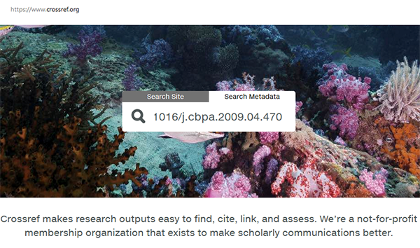

Establishing Scholarly Identity with the Online Research Contributor Identifier (ORCID)
=======

 

## Learn about managing your ORCID profile.  

If you're reading this on the github, repo, please see the rendered lesson at: 
http://authorcarpentry.github.io/orcid-profile

*Content Contributors: Gail Clement, Tom Morrell*

*Lesson Maintainers: Gail Clement, Tom Morrell*

**Lesson status: In Development.**

-----

## What you will learn:

* Register for an ORCID account and activate it (or look up an existing ORCID)
* Sign in to your ORCID account and edit your profile by populating basic account fields
* Apply desired privacy settings to the data in your ORCID profile
* Enter works in your ORCID profile using three different approaches:
    * Enter a Digital Object Identifier (DOI) 
    * Use the Search & Link tool 
    * Upload a BibTex citation 
* Compare displayed citations from various input approaches and recognize display differents based on different data sources
* Register for an author profile with a third party system (eg, ScienceOpen, ImpactStory, MySciEnCV) using your ORCID number and observe that the third party profile autopopulates with data in your ORCID account

-----

## Topics:

1. [Your OrCiD Profile](00-orcid-profile.html)
2. [Adding Works](01-adding-works.html)

-----

## Requirements

Author Carpentry's teaching is hands-on, so participants are encouraged to use
their own computers to insure the proper setup of tools for an efficient
workflow.

*Before* working through this lesson you will need: 

* Three citations to your works, including at least two with Digital Object Identifiers issued by CrossRef. 
* For demonstration purposes in this lesson, we are using the "Works" entries publicly displayed on [Hugh Shanahan's ORCID profile](https://orcid.org/0000-0003-1374-6015) at [https://orcid.org/0000-0003-1374-6015](https://orcid.org/0000-0003-1374-6015). 

Hugh is co-chair of the [CODATA-RDA schools in Research Data Science](http://www.codata.org/working-groups/research-data-science-summer-schools) and loves when students use his ORCiD!

-----

## Tips

If you are not sure that your publication's DOI was issued by the CrossRef DOI Agency, visit the [CrossRef Metadata Search](https://search.crossref.org/). On the 'Search Metadata' tab, enter the DOI number starting with the '10' prefix. A record will display if the DOI was issued by CrossRef. 

